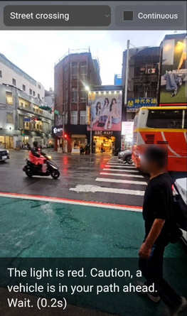
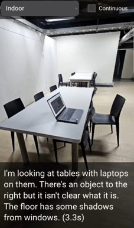
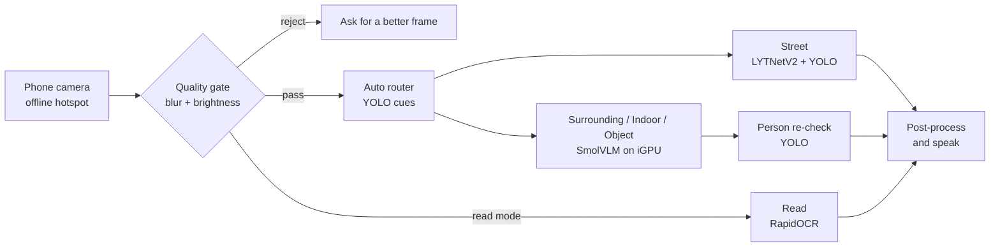

# Offline Visual Assistant for Blind and Low-Vision Users

An offline assistant that describes the scene in front of a blind or low-vision user and speaks it aloud. It runs on an ordinary laptop with no internet connection; a phone on the same hotspot acts as the camera and speaker.

Research internship project, **Information Processing Laboratory, National Central University (Taiwan)**, June–July 2026.

> Full title: *VLM-Powered Offline Visual Description Assistant for Visually Impaired Users on Consumer NPU: A Feasibility and Deployment-Gap Study*

  
  &nbsp;&nbsp;
  

Phone client in Street mode (left) and Indoor mode (right). Faces of passers-by are blurred.

## The question

Can a small vision-language model (VLM) running on a consumer laptop's NPU help blind and low-vision people in safety-critical moments, such as crossing a street, without sending images to the cloud?

## What the system does

| Mode | What the user hears | How it works |
|---|---|---|
| **Street** | Pedestrian light colour and whether a vehicle is in the path | Dedicated traffic-light classifier (LYTNetV2) + YOLOv8n vehicle detection, no VLM |
| **Surrounding** | One sentence on what is around and where | SmolVLM on the laptop iGPU |
| **Indoor** | Layout ahead and obstacles in the walking path | SmolVLM (or Gemma-3-4B on the NPU for more detail) |
| **Object** | What the held object is | SmolVLM |
| **Read** | Text in front of the camera | Offline OCR (RapidOCR) |
| **Auto** | Picks the mode itself | YOLO-based router |

Safety features around the models:

- **Quality gate**: blurred or dark frames are refused (about 1 ms check), and the user is asked to hold steady.
- **Person re-check**: if YOLO sees a person close to the camera but the VLM does not mention one, the system adds "A person is in front of you."
- **Phone-friendly UX**: tap anywhere to describe, strong vibration on danger words, hands-free continuous mode, on-device speech.

## Architecture

## What I learned

1. **Measure on the real device.** Vendor NPU figures did not translate into speed for a small VLM; on this laptop the integrated GPU was the practical choice for real-time use.
2. **A general model is not always the right tool.** For traffic-light colour and reading text, small dedicated models (a light classifier and OCR) were far more reliable than the VLM, so the final design is a hybrid.
3. **Safety needs its own checks.** Small VLMs sometimes describe things that are not there, so the system adds rule-based guards instead of trusting one model.
4. **Field testing changes the design.** Testing at real pedestrian crossings in Taiwan led to new guards, for example refusing to guess the light colour when no light is visible or the scene is too dark.

Detailed benchmark numbers will be added once the paper is published.

## My role

I worked on deployment, the prototype and field testing:

- Deployed and benchmarked vision-language models (SmolVLM-256M/500M, Gemma-3-4B) on CPU, iGPU and NPU, including ONNX export and INT8 quantization
- Built the assistant in Python: mode pipeline, router, quality gate, post-processing, text-to-speech and the phone web client
- Field-tested the app at real street crossings and turned the findings into new safety guards
- Presented progress weekly in English and co-wrote the English research report

Teammate **Boonyanuch Phongphaew** led the datasets, statistics and literature review.

## Tech stack

Python · PyTorch · Hugging Face Transformers · ONNX Runtime (DirectML, VitisAI EP) · YOLOv8 (Ultralytics) · OpenCV · RapidOCR · Piper TTS · Web Speech API

**Hardware:** AMD Ryzen AI 7 350 laptop (Radeon 860M iGPU, XDNA 2 NPU, 32 GB RAM)

## Limitations

- One hardware platform; results may not transfer to other NPUs or toolchains.
- English output only; Thai speech was not evaluated.
- Evaluated against researcher-written ground truth, not yet with blind or low-vision users.
- Street mode is validated in daylight only.

## Code and data

The source code, evaluation scripts and data are kept private until the paper is published. Feel free to contact me if you would like to know more.

## Acknowledgements

Supervised by **Assoc. Prof. Huang-Chia Shih**, Information Processing Laboratory, Department of Information Management, National Central University, Taiwan. Internship under the Faculty of ICT, Mahidol University.

---

**Panida Srisuthangkul** · [LinkedIn](https://www.linkedin.com/in/panida-srisuthangkul) · [GitHub](https://github.com/panidasrs)
